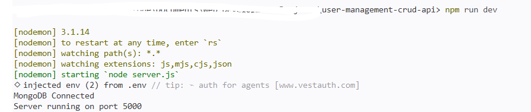
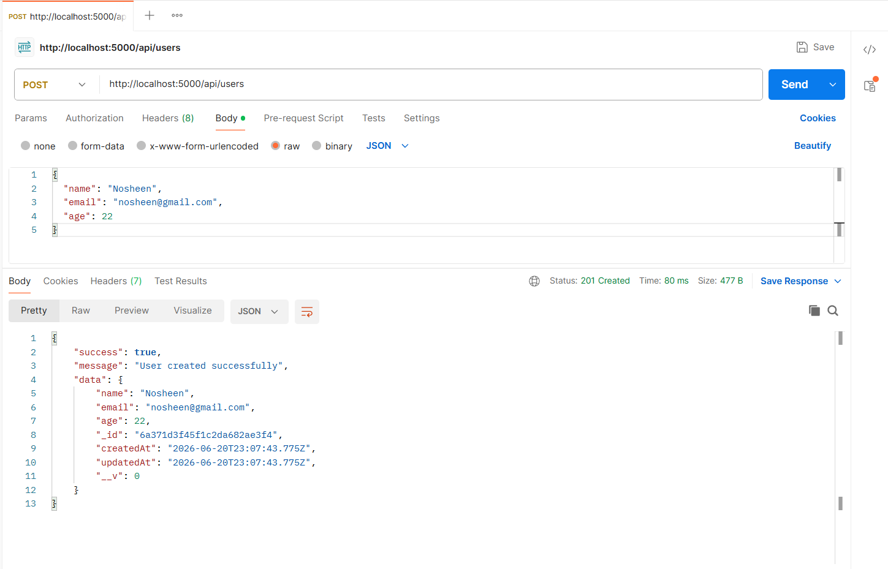
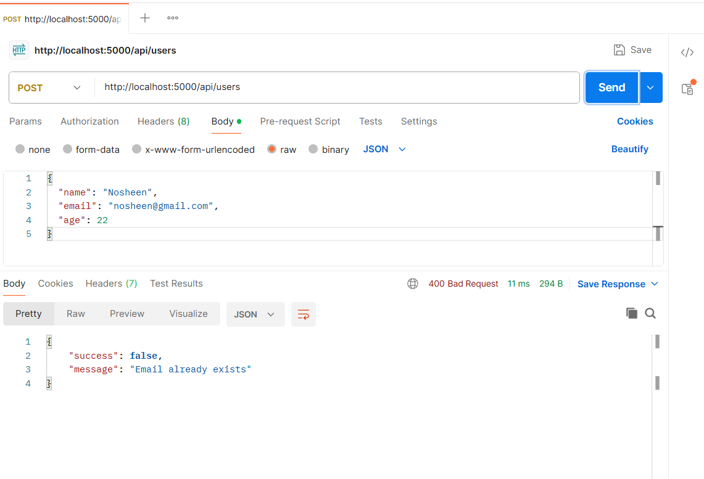
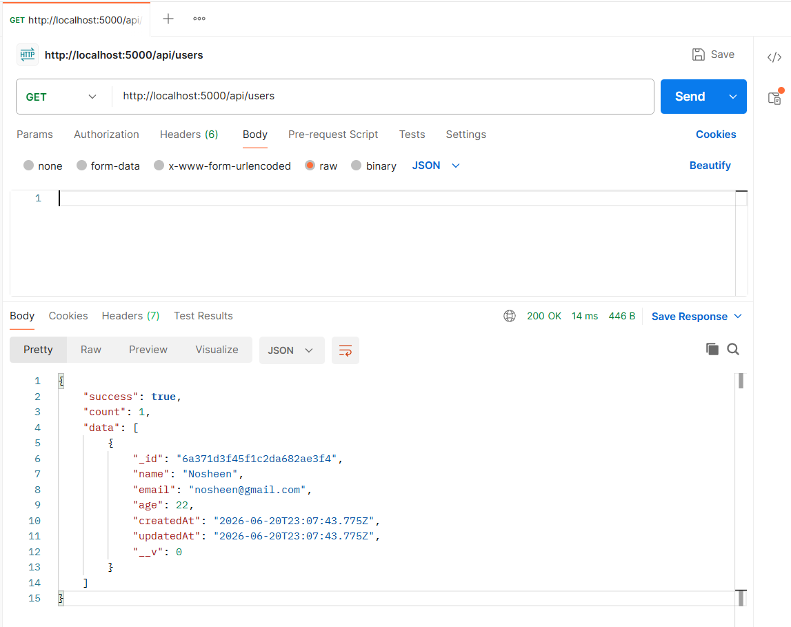
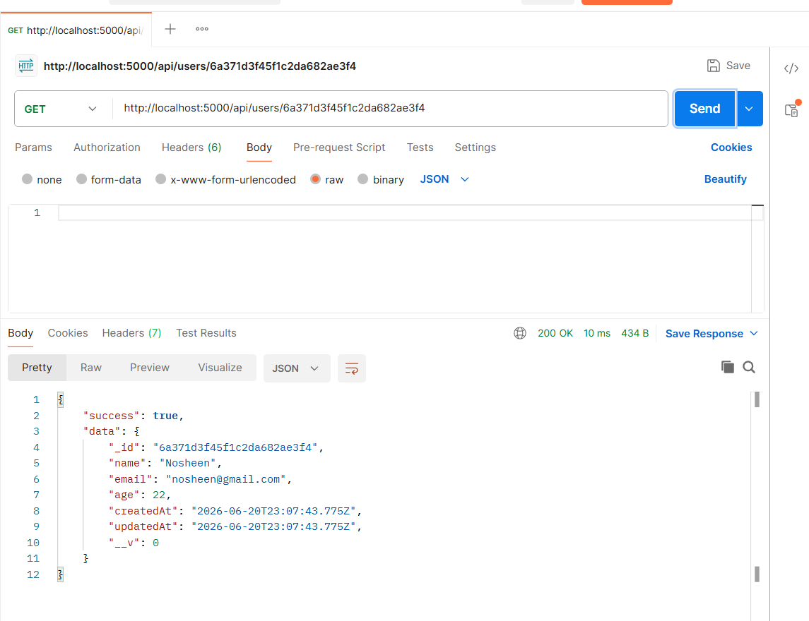
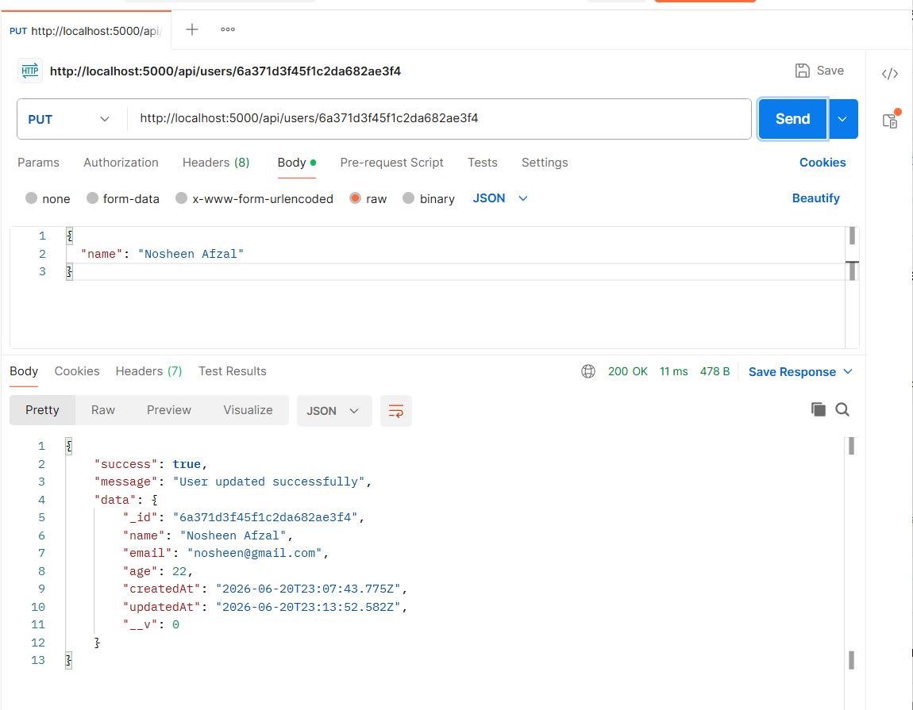
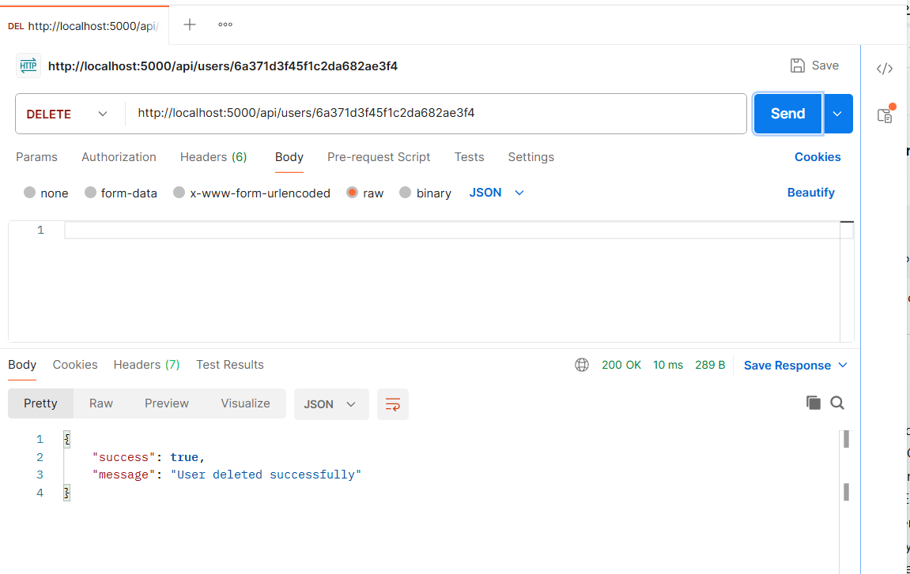

# Task-2-Nosheen-Afzal

## User Management CRUD API

### Project Overview

This project was developed as part of the DecodeLabs Backend Development Training Program. The objective of this project is to integrate a database with a REST API and implement complete CRUD (Create, Read, Update, Delete) operations using MongoDB and Mongoose.

The application stores user information permanently in a MongoDB database and provides API endpoints for managing user records.

## Features

* Create a new user
* Retrieve all users
* Retrieve a user by ID
* Update user information
* Delete a user
* Prevent duplicate email entries
* Store data permanently using MongoDB
* Return structured JSON responses

## Technologies Used

* Node.js
* Express.js
* MongoDB
* Mongoose
* Postman
* Nodemon

## Project Structure

```text
Task-2-Nosheen-Afzal/
│
├── models/
│   └── User.js
│
├── routes/
│   └── userRoutes.js
│
├── screenshots/
│
├── .gitignore
├── package.json
├── package-lock.json
├── server.js
├── README.md
└── Backend Task 2.pdf
```

## Installation

### Clone Repository

```bash
git clone https://github.com/nosheenawan467/Task-2-Nosheen-Afzal.git
```

### Navigate to Project Directory

```bash
cd Task-2-Nosheen-Afzal
```

### Install Dependencies

```bash
npm install
```

### Configure Environment Variables

Create a `.env` file:

```env
PORT=5000
MONGO_URI=mongodb://127.0.0.1:27017/studentDB
```

### Run the Project

```bash
npm run dev
```

Expected Output:

```bash
MongoDB Connected
Server running on port 5000
```

## API Endpoints

### Create User

**POST** `/api/users`

Request Body:

```json
{
  "name": "Nosheen",
  "email": "nosheen@gmail.com",
  "age": 22
}
```

### Get All Users

**GET** `/api/users`

### Get User By ID

**GET** `/api/users/:id`

### Update User

**PUT** `/api/users/:id`

Request Body:

```json
{
  "name": "Nosheen Afzal"
}
```

### Delete User

**DELETE** `/api/users/:id`

## Database Schema

```javascript
{
  name: String,
  email: String,
  age: Number
}
```

### Validation Rules

* Name is required
* Email is required
* Email must be unique
* Age is required

## Screenshots

### MongoDB Connection



### Create User



### Duplicate Email Validation



### Get All Users



### Get User By ID



### Update User



### Delete User



## Testing

The API was tested using Postman for:

* Create User
* Duplicate Email Validation
* Get All Users
* Get User By ID
* Update User
* Delete User

## Author

**Nosheen Afzal**

Backend Development Project 2 – User Management CRUD API

DecodeLabs Industrial Training Program (Batch 2026)
